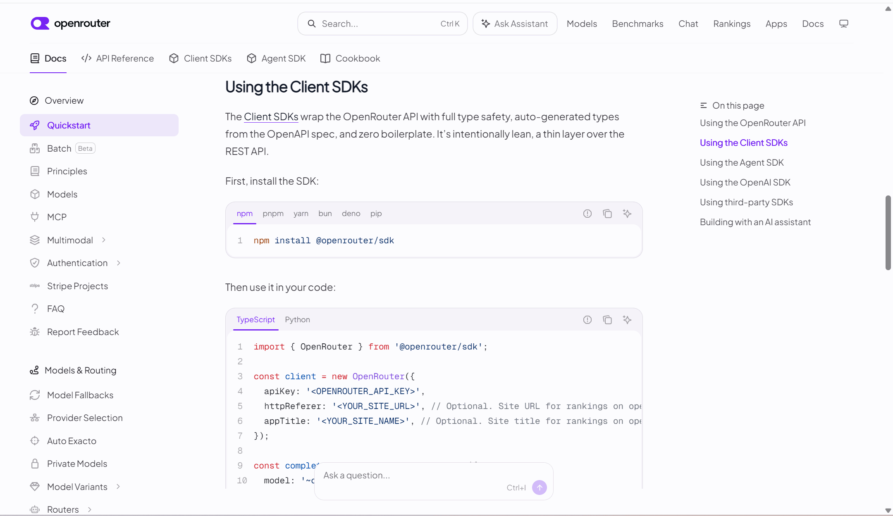
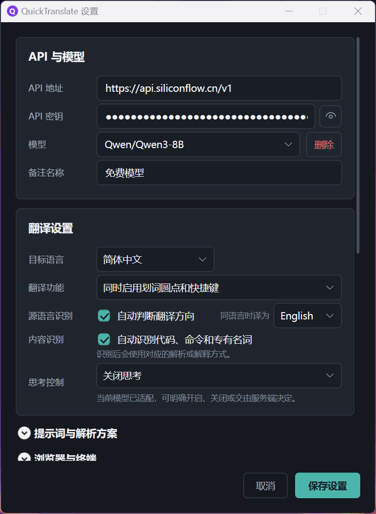
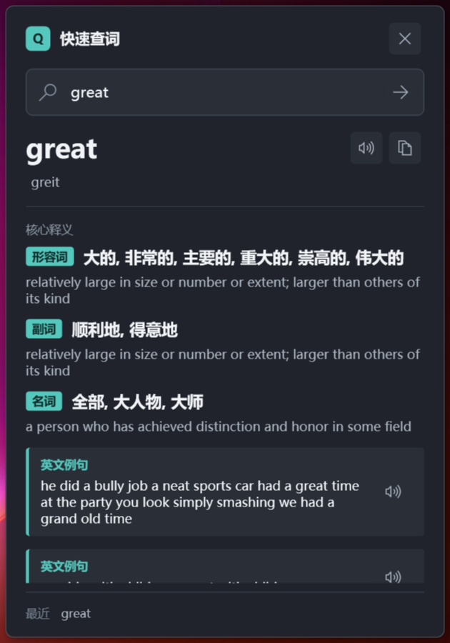
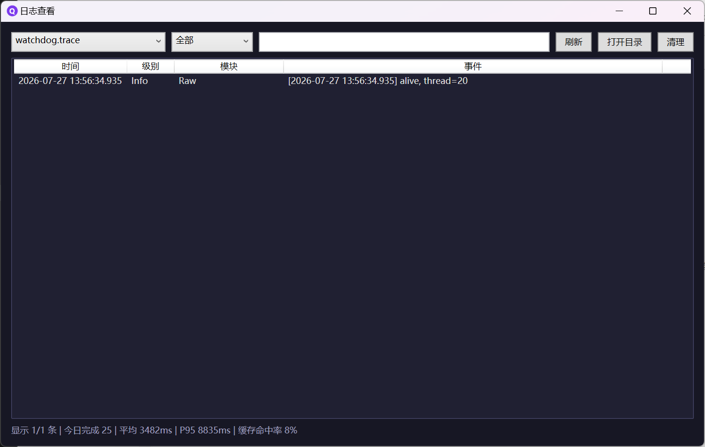

<div align="center">


# QuickTranslate

**More than translation. Select text and start understanding with AI.**

QuickTranslate is a Windows AI tool built for reading workflows. Select text to get AI translation, local-dictionary lookup with cloud-model enhancement, code and terminology analysis, and follow-up questions grounded in the result. No repeated copy-paste or window switching: a single selection can move from literal reading to real understanding.

<br>

[](https://dotnet.microsoft.com/download/dotnet/8.0)
[](https://github.com/dotnet/wpf)
[](https://learn.microsoft.com/dotnet/csharp)
[](https://github.com/YAHU2024/myTool/releases/latest)
[](https://github.com/YAHU2024/myTool/releases)
[](https://github.com/YAHU2024/myTool/stargazers)
[](https://github.com/YAHU2024/myTool/actions/workflows/build.yml)
[](LICENSE)
[](README.md)

<br>

[Download & install](#download--install) · [Run from source](#quick-start-from-source) · [See the demos](#screenshots) · [Open an issue](https://github.com/YAHU2024/myTool/issues)

</div>

---

## Three AI Experiences, One Open Entry Point

| Core experience | What QuickTranslate does |
|:---------|:----------------------|
| **AI smart translation** | Automatically matches the selected text type and language, chooses the appropriate task and translation direction, supports switching target language or model within the current session, and streams results incrementally |
| **AI lookup** | Prioritizes ECDICT + OEWN local dictionaries, uses the cloud model to fill in missing Chinese meanings, and generates structured explanations, phonetics, examples, and collocations when local results are missing |
| **AI lightweight follow-up** | Continue asking questions based on the deep-analysis result, holding up to 10 turns of context; start from one uncertainty and unpack unfamiliar concepts step by step |
| **Open model integration** | Use your own OpenAI-compatible endpoint, freely switch Base URL and Model without being locked to a single provider |

Local dictionary hits default to offline mode. Settings and history stay on-device, and privacy-safe logs do not record selected text, prompt bodies, or API keys.

For a problem or feature idea, use “反馈问题” in the tray menu or “帮助与反馈” in Settings. The app only opens a public GitHub Issue form in your browser; it never uploads logs or submits an issue for you. Review and remove anything you do not want to publish. After an unclean exit, the next successful startup can show one dismissible feedback prompt; this can be disabled in the same Settings section.

The feedback window shows a public-content preview before leaving the app and lets you copy fields individually into the GitHub form. The category and core description are the necessary inputs; reproduction steps, expected results, alternatives, and the environment summary may be left empty. Clearing the diagnostic summary leaves only your own text, and opening or closing the browser is never recorded as an issue submission.

> If it helps you, please give the project a [**Star**](https://github.com/YAHU2024/myTool) so more people can discover it.

## Features

### AI text selection translation · red-dot guidance

<p align="center">
  
</p>

Select text to open a red-dot guide and route it into translation, code, or terminology mode. Results are streamed in real time. The feature supports drag, double-click, and triple-click activation. Translation mode makes a conservative direction decision by default, but you can switch the target language from the status bar with one click. The floating window also supports temporarily using a saved model for the current text without modifying the global default settings.

---

### Follow-up analysis · keep understanding the result

<p align="center">
  
</p>

After deep analysis, you can continue asking questions in the same floating window, with up to 10 turns of context retained. Answers stream in place, and you can revisit, locate, or retry the last turn from history nodes.

When a model explicitly returns a reasoning field for any streamed answer, the floating window shows a ChatGPT-style **Thinking** block below that answer. It stays expanded while generating and collapses when complete; arrow controls reveal or hide it. Thinking is capped at 8,000 Unicode scalar values. The block supports the same deliberate Markdown selection, code-block copy, and safe-link behavior as the answer, while **Copy all** still copies only the final answer. Thinking exists only for the current session and is excluded from the final answer, speech, history, cache, logs, and later follow-up context. Switching modes preserves the session's per-mode thinking state; a regeneration clears the replaced mode's previous thinking. The block stays hidden when the provider does not support it.

---

### Settings window · multi-model and shortcut management

<p align="center">
  
</p>

Multi-model switching, custom global shortcuts, and analysis profile management — **changes apply immediately without restart**.

---

### AI lookup · local dictionary foundation, cloud-model completion

<p align="center">
  
</p>

Click the tray icon or press `Alt+W` to open a compact lookup panel. **Local dictionaries (ECDICT + OEWN) take priority**, and AI fills in missing Chinese definitions when needed. When local results are absent, it falls back to the cloud model to generate structured definitions and optionally provide phonetics, examples, and collocations.

---

### Translation history · local search and Anki export

<p align="center">
  
</p>

SQLite keeps history locally, supports time/language search and filters, paginated browsing, and **one-click Anki export**.

---

### Log viewer · JSON Lines and latency metrics

<p align="center">
  
</p>

Structured JSON Lines logs, multi-file switching, level and keyword filtering, **P50/P95/P99 latency statistics**, and automatic cleanup of expired logs. Log viewing and retention controls live under the collapsed “开发者选项” (Developer options) section in Settings and are never uploaded automatically.

---

## Table of contents

- [QuickTranslate](#quicktranslate)
  - [Three AI Experiences, One Open Entry Point](#three-ai-experiences-one-open-entry-point)
  - [Features](#features)
    - [AI text selection translation · red-dot guidance](#ai-text-selection-translation--red-dot-guidance)
    - [Follow-up analysis · keep understanding the result](#follow-up-analysis--keep-understanding-the-result)
    - [Settings window · multi-model and shortcut management](#settings-window--multi-model-and-shortcut-management)
    - [AI lookup · local dictionary foundation, cloud-model completion](#ai-lookup--local-dictionary-foundation-cloud-model-completion)
    - [Translation history · local search and Anki export](#translation-history--local-search-and-anki-export)
    - [Log viewer · JSON Lines and latency metrics](#log-viewer--json-lines-and-latency-metrics)
  - [Table of contents](#table-of-contents)
  - [Feature highlights](#feature-highlights)
  - [Quick Start](#quick-start)
    - [Requirements](#requirements)
    - [Run](#run)
  - [Download & Install](#download--install)
  - [Configure API](#configure-api)
  - [Project Structure](#project-structure)
    - [Top-level layout](#top-level-layout)
  - [Release & Update](#release--update)
    - [Dual installer](#dual-installer)
    - [Auto update](#auto-update)
  - [Roadmap](#roadmap)
  - [Open Source Acknowledgements](#open-source-acknowledgements)
  - [License](#license)

---

## Feature highlights

| Category | Features |
|:-----|:-----|
| Core translation | SSE streaming output · drag/double-click/triple-click selection · red-dot guidance · floating-window preview · 14 languages supported · conservative auto-detection and session-level target-language switching |
| Smart detection | Automatically distinguishes Translation / Code / Term and routes specialized prompts · keeps technical docs intact in low-confidence cases · browser / terminal awareness |
| Multi-mode sessions | Same text can switch among Translate / Command parsing / Terminology explanation / Deep analysis · instant restore of finished results · current-session model switching |
| Follow-up analysis | Deep analysis can continue with up to 10 contextual turns · streaming replies · history-node navigation · retry on last failed turn |
| Quick lookup | Local dictionary priority (ECDICT/OEWN) · automatic AI fallback on miss · one-click AI Chinese completion · normalized POS labels · structured definitions / phonetics / examples / collocations · last 5 items · spoken output and copy · centered popup / show-hide toggle |
| Markdown | Incremental streaming rendering · fence-closed code highlighting and standalone copy · tables / lists / quotes · only http/https links allowed |
| Text-to-speech | Edge TTS online synthesis · read selected text · one-click read of translation result · automatic language matching |
| Translation history | SQLite local persistence · time/language search and filtering · pagination · double-click copy · Anki export |
| System integration | Two independent global shortcut sets (selection translation / quick lookup) · lookup shortcut has enable/disable switch off by default · tray click quick lookup · right-click restore latest translation · startup auto-launch · browser trigger · single-instance protection |
| Deep analysis | 4 built-in presets (general / language learning / literary appreciation / business) · create / duplicate / edit / delete custom profiles · multi-turn profile management |
| Model access | Built-in presets for four vendors · custom OpenAI-compatible Base URL and Model · saved configurations support notes and grouping · floating window can temporarily switch the current-session model · three-state thinking control · send thinking parameters only when the provider model is verified compatible |
| Performance | LRU + TTL semantic cache · latest-request-wins protection · request snapshot isolation · changing settings does not affect in-flight requests |
| Result quality | Original-text echo detection and status hints · suspicious results are never cached or archived · no silent retry or automatic model switching |
| Auto update | GitHub Releases distribution · silent startup check · in-app update changelog · system proxy support · Inno Setup dual installer · SHA256 verification |
| Privacy & security | Zero-pollution clipboard capture · terminal-safe extraction avoids accidental Ctrl+C · log redaction (no original text / API keys / prompt body) · local config never uploaded |
| Operations & diagnostics | Structured JSON Lines logs · dedicated viewer · multi-file switching · level / keyword filtering · P50/P95/P99 latency · automatic cleanup |

---

## Quick Start

### Requirements

- Windows 10 / 11
- [.NET 8 SDK](https://dotnet.microsoft.com/download/dotnet/8.0)

### Run

```powershell
git clone https://github.com/YAHU2024/myTool.git
cd myTool\QuickTranslate

dotnet run
```

After launch, the app minimizes to the system tray automatically. Right-click the tray icon to configure it.

Once translation is complete, you can switch the current target language from the floating window status bar. This change only applies to the current text session and remains after refreshes, mode changes, and current-session model switching. A newly selected text restores the automatic language decision. The model button lets you temporarily use a saved model without changing the global default in settings.

If the final result is highly similar to the original text, the floating window keeps the body and displays a hint, but that result will not be written to cache or translation history and will not trigger silent retry or automatic model switching.

Click the tray icon or press `Alt+W` (enable "Quick Lookup shortcut" in Settings first) to show or hide the quick lookup panel. Enter a word or phrase and press `Enter` to query. Lookup prefers the local dictionary at `Data\word-dictionary.db` (ECDICT + OEWN), local entries display part-of-speech labels in Chinese, ECDICT Chinese definitions and OEWN English definitions are shown in separate fields, and OEWN examples are marked as "English example". Local hits default to no network or API usage. Only when the user clicks "AI 补全中文" does missing English definitions and examples go to the configured OpenAI-compatible provider. After enrichment, the source is labeled "本地词典 + AI 补全 · model name". Missing local entries still fall back to AI lookup. Release builds include the local dictionary by default; source builds need to run `scripts\prepare-word-dictionary.ps1` from the repository root first to generate it. The last 5 items are stored only in the current process and are cleared on exit. Right-click the tray menu and choose "Restore latest translation" to reopen the most recent selection translation result.

> If you do not want to install the .NET SDK, jump to [Download & Install](#download--install) and get the self-contained installer.

---

## Download & Install

Don't want to set up a development environment? Download the installer directly — **double-click and run, without needing the .NET 8 SDK**.

| Edition | Size | Notes |
|:-----|:-----|:-----|
| **Full (recommended)** | ~85 MB | Self-contained runtime and local dictionary, ready to use → [Download the latest full edition](https://github.com/YAHU2024/myTool/releases/latest) |
| **Standard** | ~47 MB | Includes the local dictionary but requires the [.NET 8 runtime](https://dotnet.microsoft.com/download/dotnet/8.0) → [All releases](https://github.com/YAHU2024/myTool/releases) |

All historical versions, changelogs, and SHA256 checksums are on the [Releases page](https://github.com/YAHU2024/myTool/releases). After installation, the app minimizes to the system tray; right-click the tray icon to configure it.

---

## Configure API

Right-click the tray icon to open the settings window:

| Field | Description | Example |
|:-----|:-----|:-------|
| Base URL | API endpoint address | `https://api.siliconflow.cn/v1` |
| API Key | Your secret key | `sk-xxxxxxxxxxxxxxxx` |
| Model | Model name | `Qwen/Qwen3-8B` |

The model dropdown groups saved configs by domain and auto-fills the URL and key on selection. Each saved profile can store a note up to 32 characters long. Saved profiles also appear in the floating window model menu so you can temporarily switch the current text session without changing the global default. Thinking control offers **Follow model default**, **Enable thinking**, and **Disable thinking**. New profiles do not send provider-specific thinking parameters by default. Zhipu and DeepSeek use `thinking.type`, SiliconFlow uses `enable_thinking`, and verified OpenAI GPT-5.2/5.4/5.5/5.6 series models use `reasoning_effort`. Models without an adapted thinking contract are locked to Follow model default: their actual behavior is determined by the service, while any returned reasoning is still displayed normally.

On first launch, Settings opens automatically with SiliconFlow `Qwen/Qwen3-8B` preselected. The model dropdown includes built-in no-key presets for SiliconFlow, Zhipu, DeepSeek, and OpenAI; you still need to fill in your own API key. Existing configs load as-is without being overwritten by new defaults. If the config file cannot be read, QuickTranslate preserves the original file, loads safe defaults, and prompts you to confirm the settings.

Quick lookup and translation use the same Base URL, API Key, and Model configuration. Local dictionary hits do not need an API key or internet access. Only missing local entries, or a user explicitly choosing "AI 补全中文", sends relevant content to the configured provider. AI-generated or translated content is meant to assist understanding and is not authoritative dictionary data; uncertain values such as phonetics may be omitted.

<details>
<summary>Quick provider reference (expand)</summary>

<br>

| Provider | Base URL | Model |
|:-------|:---------|:------|
| SiliconFlow (recommended) | `https://api.siliconflow.cn/v1` | `Qwen/Qwen3-8B` |
| Zhipu GLM | `https://open.bigmodel.cn/api/paas/v4` | `glm-4.7-flash` |
| DeepSeek | `https://api.deepseek.com/v1` | `deepseek-v4-flash` |
| OpenAI | `https://api.openai.com/v1` | `gpt-5.4` |

</details>

<br>

> Logging guide, privacy boundaries, and developer integration: [Logging docs](docs/LOGGING.md).

---

## Project Structure

> This block is generated by `scripts/update-readme-tree.py` — do not edit manually; run `python scripts/update-readme-tree.py --write` after source changes.

```text
QuickTranslate/
├── Core/                  # Core engine
│   ├── GlobalKeyboardHook.cs                # Global keyboard hook (independent message loop)
│   ├── SelectionDetector.cs                 # Mouse hook selection detection (drag/double/triple-click)
│   ├── SelectionLocator.cs                  # UIA pixel-level selection locator
│   ├── ClipboardHelper.cs                   # Zero-pollution clipboard (serial detection + restore)
│   ├── ContentTypeDetector.cs               # Smart content detection (Translation / Code / Term)
│   ├── BrowserDetector.cs                   # Browser window awareness
│   ├── TerminalDetector.cs                  # Terminal host awareness + copy-risk detection
│   ├── SelectionCapturePolicy.cs            # Selection-copy safety policy
│   ├── UiaCircuitBreaker.cs                 # UIA failure breaker and recovery
│   ├── CopyShortcut.cs                      # Copy shortcut helper
│   ├── AnalysisConversationFormatter.cs     # Analysis follow-up conversation formatting
│   ├── AutoScrollController.cs              # Streaming auto-scroll (pause/resume on user action)
│   ├── LatestRequestCoordinator.cs          # latest-request-wins request coordination
│   ├── LatestPresentationCoordinator.cs     # Presentation identity coordination
│   ├── FloatingResultSessionCoordinator.cs  # Multi-mode session coordination
│   ├── TranslationDirectionResolver.cs      # Auto/manual translation direction decisions
│   ├── TranslationRouteResolver.cs          # Translation and explanation mode routing
│   ├── ModelProfileCatalog.cs               # Session-level available model profile catalog
│   ├── ModelSelectionCoordinator.cs         # Session-level model-switch coordination
│   ├── TrayClickCoordinator.cs              # Tray interaction coordination (left/right/scroll)
│   ├── WordLookupSessionCoordinator.cs      # Lookup session race-condition guard
│   ├── WordLookupTextFormatter.cs           # Lookup result text formatter
│   ├── RecentLookupBuffer.cs                # Recent lookup buffer
│   ├── ReasoningSummaryAccumulator.cs       # Reasoning summary accumulation (cap enforcement)
│   ├── StreamingCompositionMetrics.cs       # Streaming composition metrics
│   ├── StreamingDispatcherMetrics.cs        # Streaming dispatch metrics
│   ├── StreamingPresentationPump.cs         # Streaming presentation frame pump (coalescing/publishing)
│   ├── StreamingRuntimeMetrics.cs           # Streaming runtime metrics
│   └── TtsPlaybackCoordinator.cs            # TTS playback coordination (multi-owner, busy avoidance)
├── Database/              # Persistence layer
│   ├── TranslationRecord.cs                 # Translation history model
│   └── TranslationDbContext.cs              # EF Core SQLite context
├── Services/              # Business services
│   ├── ITranslationService.cs               # Translation service interface
│   ├── TranslationStreamEvent.cs            # Streaming event kinds (started / content delta / reasoning delta / completed)
│   ├── OpenAITranslationService.cs          # OpenAI-compatible streaming translation
│   ├── ProviderKind.cs                      # Official API host and provider parsing
│   ├── ProviderModelCapabilities.cs         # Shared model capability descriptor
│   ├── ProviderRequestPolicy.cs             # Provider request parameter policy
│   ├── ProviderHttpError.cs                 # Safe provider HTTP error extraction
│   ├── TranslationPromptBuilder.cs          # Translation task and input-protection prompts
│   ├── TranslationEchoDetector.cs           # Original-text echo quality detection
│   ├── BigModelModelCapabilities.cs         # Zhipu model-thinking capabilities
│   ├── DeepSeekModelCapabilities.cs         # DeepSeek model-thinking capabilities
│   ├── SiliconFlowModelCapabilities.cs      # SiliconFlow model-thinking capabilities
│   ├── OpenAIModelCapabilities.cs           # OpenAI reasoning capabilities
│   ├── PromptInputContract.cs               # Model input safety and length contract
│   ├── TranslationCacheService.cs           # Semantic cache (LRU + 30 min TTL)
│   ├── TranslationMetrics.cs                # Metrics (P50/P95/P99)
│   ├── HistoryExporter.cs                   # History export (Anki/CSV)
│   ├── AnalysisPromptCatalog.cs             # Built-in / custom analysis profiles
│   ├── UpdateService.cs                     # Auto-updater (GitHub Release + AutoUpdater.NET)
│   ├── FeedbackContentBuilder.cs            # Public feedback fields and sensitivity checks
│   ├── FeedbackLinkService.cs               # Fixed GitHub Issue Form links
│   ├── CrashRecoveryTracker.cs              # Unclean-exit state and recovery-prompt tracking
│   ├── ITtsService.cs                       # TTS service interface
│   ├── EdgeTtsService.cs                    # Edge TTS read-aloud service
│   ├── EdgeTtsClient.cs                     # Edge TTS WebSocket client
│   ├── TtsTextSelector.cs                   # TTS text selector
│   ├── TtsSpeakException.cs                 # TTS exception class
│   ├── IWordLookupService.cs                # Word lookup service interface
│   ├── IWordLookupEnrichmentService.cs      # AI word lookup enrichment interface
│   ├── OpenAIWordLookupService.cs           # OpenAI-compatible word lookup service
│   ├── LocalDictionaryWordLookupService.cs  # ECDICT + OEWN local lookup
│   ├── CompositeWordLookupService.cs        # Local dictionary first, AI fallback
│   ├── WordLookupPromptBuilder.cs           # Word lookup prompt builder
│   └── WordPartOfSpeechNormalizer.cs        # POS label normalization
├── Models/                # Data models
│   ├── AppSettings.cs                       # Settings (multi-model / hotkeys / profiles / updates)
│   ├── ProviderPreset.cs                    # Credential-free provider preset catalog
│   ├── TranslationRequest.cs                # Immutable request snapshot
│   ├── TranslationRequestContext.cs         # Session request semantic snapshot
│   ├── TranslationDirectionDecision.cs      # Translation direction decision result
│   ├── FloatingResultSession.cs             # Multi-mode session state
│   ├── AnalysisPromptProfile.cs             # Custom analysis profile
│   ├── AnalysisFollowUpRequest.cs           # Analysis follow-up request and semantic snapshot
│   ├── TranslationTriggerMode.cs            # Translation trigger mode enum
│   ├── ThinkingModePreference.cs            # Thinking-mode preference
│   ├── FeedbackModels.cs                    # Feedback draft, diagnostics, and field models
│   └── WordLookupModels.cs                  # Word lookup result models (definition / phonetic / example / collocation)
├── Helpers/               # Utilities
│   ├── ConfigManager.cs                     # JSON configuration read/write + migration
│   ├── Logger.cs                            # Async logger (JSON Lines / rotation / cleanup)
│   ├── LogEvent.cs                          # Structured log event model
│   ├── MarkdownRenderer.cs                  # Safe Markdown renderer
│   ├── StreamingMarkdownRenderer.cs         # Streaming Markdown renderer
│   ├── CodeSyntaxHighlighter.cs             # Local code-block syntax highlighting
│   ├── Win32Api.cs                          # Win32 P/Invoke declarations
│   ├── DpiHelper.cs                         # DPI coordinate conversion
│   ├── ApiEndpointValidator.cs              # API endpoint format validation
│   └── AuthenticodeVerifier.cs              # Installer digital-signature verification
├── UI/                    # User interface
│   ├── FloatingWindow.xaml/.cs              # Floating window (multi-mode / Markdown / TTS / pin)
│   ├── MarkdownInteraction.cs               # Markdown interaction helper
│   ├── RedDotWindow.xaml/.cs                # Red-dot guidance window
│   ├── QuickLookupWindow.xaml/.cs           # Quick lookup window (structured definitions / speech)
│   ├── TrayIconManager.cs                   # System tray (context menu / toast)
│   ├── SettingsWindow.xaml/.cs              # Settings (models / hotkeys / profiles / updates)
│   ├── DownloadUpdateWindow.xaml/.cs        # Update download window
│   ├── UpdateAvailableWindow.xaml/.cs       # Update details and confirmation
│   ├── ModelSelectorControl.xaml/.cs        # Current-session model selector
│   ├── HistoryWindow.xaml/.cs               # Translation history viewer
│   ├── LogViewerWindow.xaml/.cs             # Log viewer
│   ├── ThoughtBlockView.cs                  # Thought-block view
│   ├── LogEntryReader.cs                    # Log reading and filtering
│   ├── FeedbackWindow.xaml/.cs              # Help and feedback window
│   ├── CrashRecoveryPromptWindow.xaml/.cs   # Unclean-exit recovery prompt
│   ├── SharedSettingsStyles.xaml            # Settings control styles reused by feedback UI
│   ├── SharedToolWindowStyles.xaml          # Shared tool-window styles
│   ├── FloatingWindowAnchor.cs              # Window anchor positioning
│   ├── FloatingWindowPlacement.cs           # Window placement management
│   ├── TrayPanelPlacement.cs                # Tray-panel placement for multi-monitor DPI
│   ├── FloatingStatusMessage.cs             # Status messages
│   └── TransientButtonFeedback.cs           # Transient button feedback
├── Assets/                # App icon resources
├── app.manifest           # Windows application manifest
├── AssemblyInfo.cs        # Assembly metadata declarations
├── QuickTranslate.csproj  # .NET 8 project file
├── MainWindow.xaml/.cs    # Hidden main window (stable WPF lifecycle)
└── App.xaml/.cs           # App entry (single-instance / update scheduling / dispatch)
```

### Top-level layout

```text
myTool/
├── .github/               # GitHub Actions workflows & issue templates
├── QuickTranslate/        # Main source project
├── QuickTranslate.Tests/  # xUnit test project (representative subset shown)
│   ├── FeedbackContentBuilderTests.cs  # Feedback fields and sensitivity tests
│   ├── FeedbackLinkServiceTests.cs     # Issue Form link tests
│   ├── CrashRecoveryTrackerTests.cs    # Unclean-exit state tests
│   └── FeedbackWindowTests.cs          # Feedback window style-loading tests
├── installer/             # Inno Setup scripts + version.xml
├── scripts/               # Helper scripts
├── site/                  # GitHub Pages project site (static pages + assets)
├── docs/                  # Project documentation
│   ├── images/                         # Documentation images
│   ├── LOGGING.md                      # Logging guide
│   ├── PR_MERGE_GUIDE.md               # PR creation, review, and merge workflow
│   ├── RELEASE.md                      # Release process
│   ├── RELEASE_NOTES_NEXT.md           # Draft for next-release notes
│   └── THIRD_PARTY_NOTICES.md          # Third-party notices
├── .gitignore             # Ignore rules
├── CONTRIBUTING.md        # Contribution guide
├── LICENSE
├── README.en.md           # English README
└── README.md
```

---

## Release & Update

### Dual installer

Inno Setup generates two installers:

| Edition | Size | Dependency |
|:-----|:-----|:-----|
| Standard | ~47 MB | Includes the local dictionary; requires the .NET 8 runtime |
| Full | ~85 MB | Includes the local dictionary and is self-contained |

### Auto update

The app silently checks GitHub Releases on startup. When a new version is available, a tray notification appears. Clicking it opens the update notes inside the app; download and installation are handled by AutoUpdater.NET with SHA256 verification.

The installer also checks for WebView2 Runtime and installs it if needed so the release notes display correctly.

See [docs/RELEASE.md](docs/RELEASE.md) for the full release process, and [docs/RELEASE_NOTES_NEXT.md](docs/RELEASE_NOTES_NEXT.md) for pending user-visible changes.

---

## Roadmap

| Phase | Core work | Status |
|:----:|:---------|:----:|
| 1 | Basic skeleton + manual translation trigger + streaming output | done |
| 2 | Select-to-translate + red-dot UI + floating window + UIA positioning + DPI adaptation | done |
| 3 | System tray + settings persistence + startup auto-launch | done |
| 4 | Translation history + hotkey customization + language auto-detection + prompt customization | done |
| 5 | Single-instance protection + signal guard + logging system + zero-pollution clipboard | done |
| 6 | Smart content detection + regression tests + browser detection + multi-model management | done |
| 7 | Request lifecycle refactor + semantic cache + latest-request-wins | done |
| 8 | Multi-mode sessions + real-time Markdown rendering + code highlighting + stream control + draggable window resizing | done |
| 9 | Structured logging + log viewer + level filtering + P50/P95/P99 metrics | done |
| 10 | Four prompt behavior contracts + built-in/custom analysis profile management + privacy-safe logs | done |
| 11 | TTS voice playback + Edge TTS synthesis + automatic language matching | done |
| 12 | Auto-update + GitHub Release distribution + Inno Setup dual installer | done |
| 13 | Quick lookup panel + independent global shortcut + tray click integration + local dictionary (ECDICT/OEWN) + AI Chinese completion + POS normalization | done |
| 14 | Follow-up analysis + multi-turn context + streaming responses + history-node navigation | done |
| 15 | Terminal-safe extraction + translation direction and smart routing + session model/direction switching + echo-quality gatekeeping | done |
| 16 | UI unification and internationalization | planned |

---

## Open Source Acknowledgements

QuickTranslate uses components such as [AutoUpdater.NET](https://github.com/ravibpatel/AutoUpdater.NET), [Markdig](https://github.com/xoofx/markdig), [ColorCode](https://github.com/CommunityToolkit/ColorCode-Universal), [Entity Framework Core](https://github.com/dotnet/efcore), and [SQLitePCLRaw](https://github.com/ericsink/SQLitePCL.raw). Its local dictionary is built from [ECDICT](https://github.com/skywind3000/ECDICT) and [Open English WordNet](https://en-word.net/). We thank these projects and their maintainers.

The complete source, versions, copyright notices, and license terms are listed in [docs/THIRD_PARTY_NOTICES.md](docs/THIRD_PARTY_NOTICES.md).

---

## License

<div align="center">

New versions released on or after 2026-08-06 are licensed under the
[Mozilla Public License 2.0 (MPL-2.0)](LICENSE).
MPL-2.0 allows personal and commercial use, modification, and redistribution. When distributing MPL-covered files with modifications, the corresponding source code for those files must also be made available. New standalone files may use other licenses. The project name, logo, and icons are not granted as trademarks.

Versions released before that date remain under their original MIT license, and this change does not retroactively affect earlier releases.

</div>
