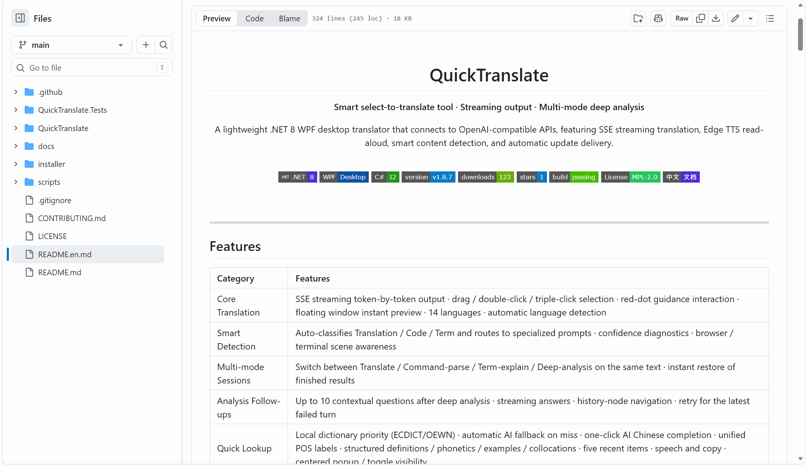
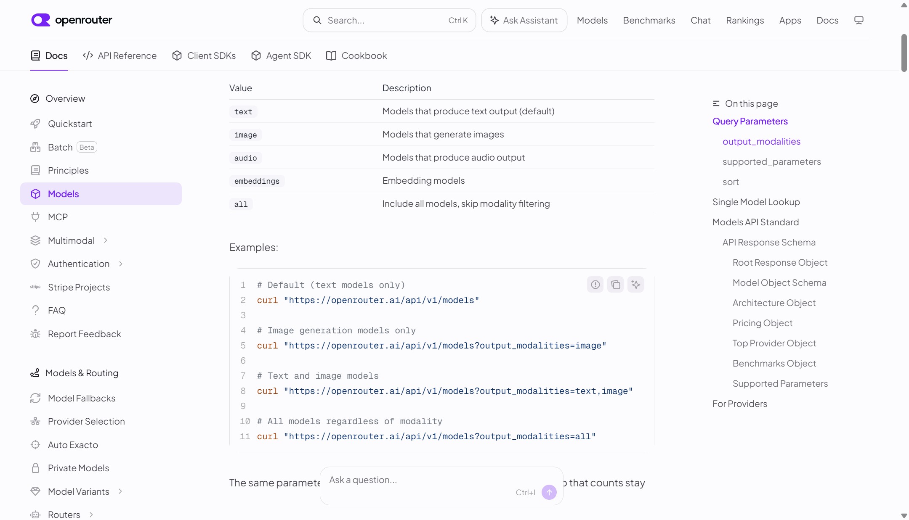
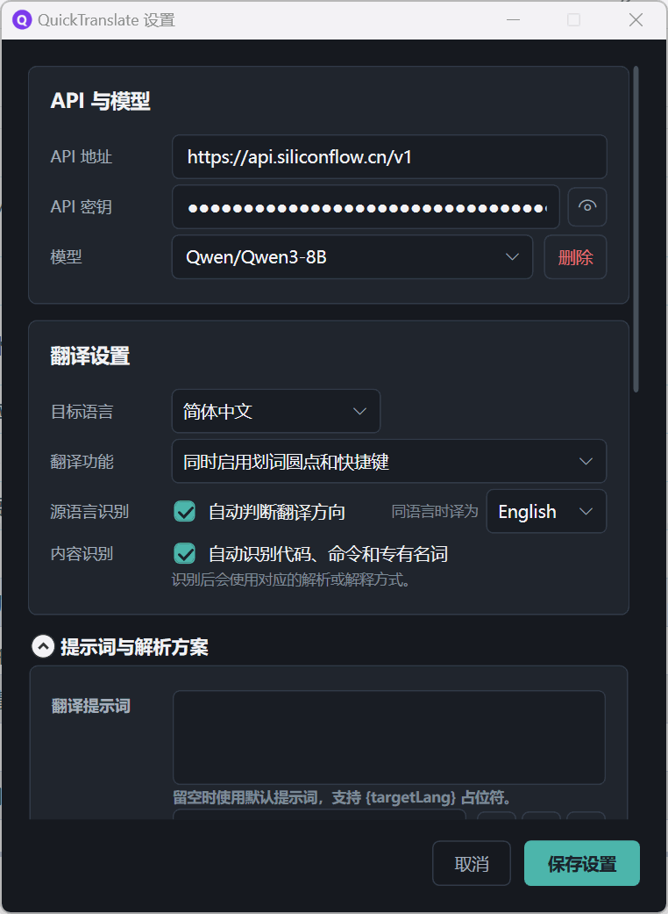
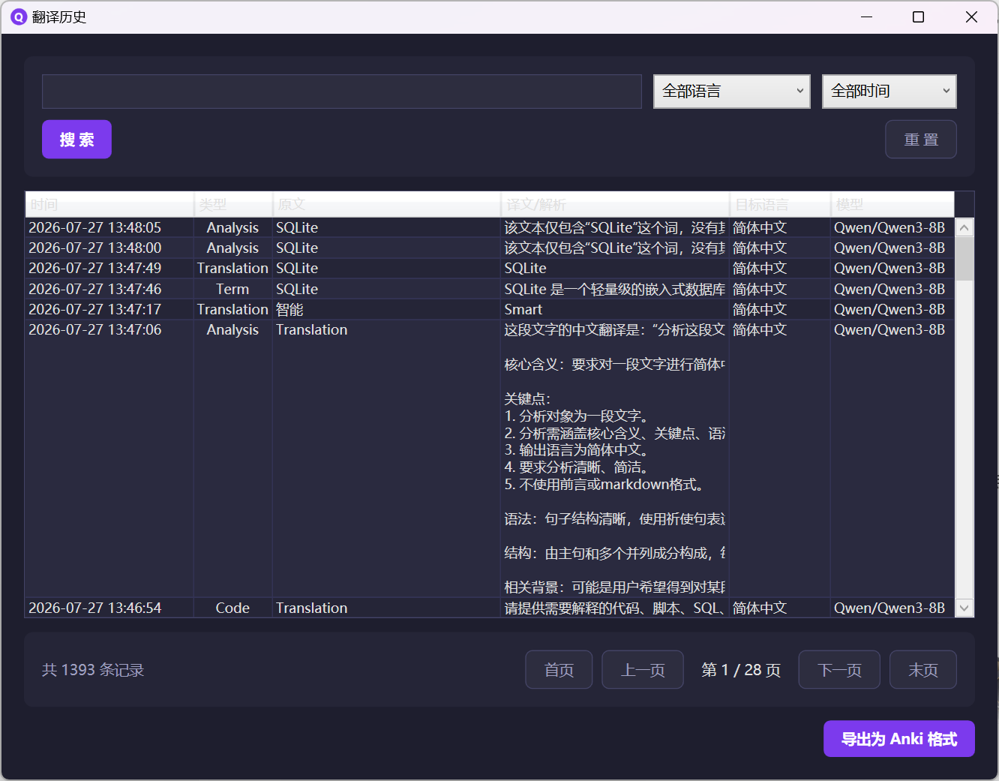

<div align="center">

# QuickTranslate

**不止翻译，选中文本即开启 AI 理解**

QuickTranslate 是一款贴着阅读场景工作的 Windows AI 工具。选中文本，即可获得 AI 翻译、本地词典与云端模型协同查词、代码与术语解析，并围绕解析结果继续追问。无需反复复制、切换窗口，让一次划词从“看懂字面”延伸到“真正理解”。

<br>

[](https://dotnet.microsoft.com/download/dotnet/8.0)
[](https://github.com/dotnet/wpf)
[](https://learn.microsoft.com/dotnet/csharp)
[](https://github.com/YAHU2024/myTool/releases/latest)
[](https://github.com/YAHU2024/myTool/releases)
[](https://github.com/YAHU2024/myTool/stargazers)
[](https://github.com/YAHU2024/myTool/actions/workflows/build.yml)
[](LICENSE)
[]()
[](README.en.md)

<br>

[下载安装](#下载安装) · [从源码运行](#快速开始) · [查看演示](#功能展示) · [提交 Issue](https://github.com/YAHU2024/myTool/issues)

</div>

---

## 三种 AI 体验，一个开放入口

| 核心体验 | QuickTranslate 能做什么 |
|:---------|:----------------------|
| **AI 智能翻译** | 根据选中文本的类型自动选择翻译、代码或术语 Prompt，并以流式方式呈现模型结果 |
| **AI 查词** | ECDICT + OEWN 本地词典优先，云端模型补全缺失中文；本地未命中时由 AI 生成结构化释义，并可补充音标、例句与搭配 |
| **AI 轻对话** | 对深度解析结果继续追问，最多保留 10 轮上下文；从一个疑问出发，把陌生概念逐层弄懂 |
| **开放模型接入** | 使用你自己的 OpenAI 兼容接口，自由切换 Base URL 和 Model，不被单一服务商绑定 |

本地命中的查词默认不联网；设置和历史保存在本机，隐私日志不记录选中文本、Prompt 正文或 API Key。

> 觉得它对你有用？欢迎给项目点一个 [**Star**](https://github.com/YAHU2024/myTool)，让更多需要桌面翻译的人找到它。

## 功能展示

### AI 划词翻译 · 红点引导

<p align="center">
  
</p>

选中文本自动弹出红点引导，根据内容进入翻译、代码或术语模式，**流式输出 AI 结果**；支持拖拽、双击和三击触发。

---

### 解析追问 · 围绕结果继续理解

<p align="center">
  
</p>

完成深度解析后，可在同一悬浮窗继续提问；最多保留 10 轮上下文，回答流式呈现，并可通过历史节点回看、定位或重试最后一轮。

---

### 设置窗口 · 多模型与快捷键管理

<p align="center">
  
</p>

多模型切换、自定义全局快捷键、解析方案管理，**即时生效无需重启**。

---

### AI 查词 · 本地词典打底，云端模型补全

<p align="center">
  
</p>

单击托盘或 `Alt+W` 呼出紧凑查词面板。**本地词典（ECDICT + OEWN）优先**，缺失中文时一键 AI 补全；本地未命中时自动交给云端模型，生成结构化释义，并按结果提供音标、例句和搭配。

---

### 翻译历史 · 本地检索与 Anki 导出

<p align="center">
  
</p>

SQLite 本地持久化存储，按时间/语言搜索筛选，分页浏览，支持 **Anki 格式一键导出**。

---

### 日志查看器 · JSON Lines 与延迟指标

<p align="center">
  
</p>

结构化 JSON Lines 日志，多文件切换、级别/关键字筛选，**P50/P95/P99 延迟统计**，自动清理过期日志。

---

## 目录

- [QuickTranslate](#quicktranslate)
  - [三种 AI 体验，一个开放入口](#三种-ai-体验一个开放入口)
  - [功能展示](#功能展示)
    - [AI 划词翻译 · 红点引导](#ai-划词翻译--红点引导)
    - [解析追问 · 围绕结果继续理解](#解析追问--围绕结果继续理解)
    - [设置窗口 · 多模型与快捷键管理](#设置窗口--多模型与快捷键管理)
    - [AI 查词 · 本地词典打底，云端模型补全](#ai-查词--本地词典打底云端模型补全)
    - [翻译历史 · 本地检索与 Anki 导出](#翻译历史--本地检索与-anki-导出)
    - [日志查看器 · JSON Lines 与延迟指标](#日志查看器--json-lines-与延迟指标)
  - [目录](#目录)
  - [功能特性](#功能特性)
  - [快速开始](#快速开始)
    - [环境要求](#环境要求)
    - [运行](#运行)
  - [下载安装](#下载安装)
  - [配置 API](#配置-api)
  - [项目结构](#项目结构)
    - [顶层目录](#顶层目录)
  - [发布与更新](#发布与更新)
    - [双版本安装包](#双版本安装包)
    - [自动更新](#自动更新)
  - [开发路线](#开发路线)
  - [开源鸣谢](#开源鸣谢)
  - [许可证](#许可证)

---

## 功能特性

| 类别 | 特性 |
|:-----|:-----|
| 核心翻译 | SSE 流式逐字输出 · 拖拽/双击/三击划词 · 红点引导交互 · 悬浮窗即时展示 · 14 种语言支持 · 语言自动检测 |
| 智能识别 | 自动区分 Translation / Code / Term，路由专用 Prompt · 置信度诊断 · 浏览器/终端场景感知 |
| 多模式会话 | 同文本支持翻译 · 命令解析 · 术语解释 · 深度解析四种模式切换 · 已完成结果瞬时恢复 |
| 解析追问 | 深度解析结果内连续追问 · 最多 10 轮上下文 · 流式回答 · 历史节点定位 · 失败尾轮重试 |
| 快速查词 | 本地词典(ECDICT/OEWN)优先 · 未命中自动回退大模型查词 · 缺失中文一键 AI 补全 · 词性统一中文显示 · 结构化释义/音标/例句/搭配 · 最近 5 项 · 朗读与复制 · 居中弹出/切换隐显 |
| Markdown | 流式增量渲染 · 围栏闭合后语法高亮与独立复制 · 表格/列表/引用 · 仅允许 http/https 链接 |
| 语音朗读 | Edge TTS 在线合成 · 选中文本朗读 · 翻译结果一键朗读 · 自动语种匹配 |
| 翻译历史 | SQLite 本地持久化 · 按时间/语言搜索筛选 · 分页浏览 · 双击复制 · Anki 格式导出 |
| 系统集成 | 两套独立全局快捷键（划词翻译 / 快速查词）· 查词快捷键带开关默认关闭 · 托盘单击快速查词 · 右键恢复最近翻译 · 开机自启 · 浏览器内触发 · 单实例保护 |
| 深度解析 | 4 种内置预设（通用/语言学习/文学赏析/商务） · 自定义方案新建/复制/编辑/删除 · 多轮方案管理 |
| 模型接入 | 自定义 OpenAI 兼容 Base URL 与 Model · 已保存配置按域名分组 · 思考模式开关默认关闭 · 智谱/DeepSeek/SiliconFlow/OpenAI 显式启停思考 |
| 性能优化 | LRU+TTL 语义缓存 · latest-request-wins 请求冲突防护 · 请求快照隔离 · 设置修改不影响运行中请求 |
| 自动更新 | GitHub Release 分发 · 启动时静默检查 · 系统代理兼容 · Inno Setup 双版本安装包 · SHA256 校验 |
| 隐私安全 | 零污染剪贴板获取 · 日志脱敏（不记录原文/API Key/Prompt 正文） · 本地配置不上传 |
| 运维诊断 | 结构化 JSON Lines 日志 · 专用查看器 · 多文件切换 · 级别/关键字筛选 · P50/P95/P99 延迟 · 自动清理 |

---

## 快速开始

### 环境要求

- Windows 10 / 11
- [.NET 8 SDK](https://dotnet.microsoft.com/download/dotnet/8.0)

### 运行

```powershell
git clone https://github.com/YAHU2024/myTool.git
cd myTool\QuickTranslate

dotnet run
```

启动后自动最小化到系统托盘，右键托盘图标即可开始配置。

单击托盘图标或按 `Alt+W`（需先在设置中开启"快速查词快捷键"）可显示或隐藏快速查词面板；输入单词或短语后按 `Enter` 查询。查词优先使用程序目录下 `Data\word-dictionary.db` 中的本地词典（ECDICT + OEWN），词性统一显示中文，ECDICT 中文释义与 OEWN 英文释义分字段展示；OEWN 原始例句标记为“英文例句”。本地命中默认不会发送任何内容；只有主动点击“AI 补全中文”时，缺少中文的英文义项和例句才会发送到当前 OpenAI 兼容 Provider，补全后来源显示“本地词典 + AI 补全 · 模型名”。未命中或未安装本地词典时仍回退到 AI 查词。正式发布包默认携带本地词典；源码运行需要先从仓库根目录执行 `scripts\prepare-word-dictionary.ps1` 生成该数据库。最近 5 项仅保存在当前进程，退出后清空。右键托盘菜单中的“恢复最近翻译”用于恢复最近一次划词翻译结果。

> 不想装 .NET SDK？可直接跳到 [下载安装](#下载安装) 下载免依赖安装包。

---

## 下载安装

不想配置开发环境？直接下载安装包，**双击即用，无需安装 .NET 8 SDK**。

| 版本 | 体积 | 说明 |
|:-----|:-----|:-----|
| **完整版（推荐）** | ~85 MB | 自包含运行时和本地词典，开箱即用 → [下载最新完整版](https://github.com/YAHU2024/myTool/releases/latest) |
| **标准版** | ~47 MB | 含本地词典，需先安装 [.NET 8 运行时](https://dotnet.microsoft.com/download/dotnet/8.0) → [所有版本](https://github.com/YAHU2024/myTool/releases) |

所有历史版本、更新日志与 SHA256 校验值见 [Releases 页面](https://github.com/YAHU2024/myTool/releases)。安装后启动会自动最小化到系统托盘，右键托盘图标即可配置。

---

## 配置 API

右键托盘图标，打开设置窗口：

| 字段 | 说明 | 示例值 |
|:-----|:-----|:-------|
| Base URL | API 接口地址 | `https://api.siliconflow.cn/v1` |
| API Key | 你的密钥 | `sk-xxxxxxxxxxxxxxxx` |
| Model | 模型名称 | `Qwen/Qwen3-8B` |

模型下拉框按域名分组展示已保存配置，选中自动填充 URL 和 Key。思考模式默认关闭；智谱与 DeepSeek 使用 `thinking.type`，SiliconFlow 使用 `enable_thinking`，已适配的 OpenAI GPT-5.2/5.4/5.5/5.6 系列使用 `reasoning_effort`。不支持或未经验证的模型不会自动附加思考参数。

快速查词与翻译使用同一组 Base URL、API Key 和 Model 配置。本地词典命中时不需要 API Key 或网络；本地未命中，或用户主动点击“AI 补全中文”时，相关查词内容才会发送到所配置的 Provider。AI 生成或翻译的内容用于辅助理解，不代表权威词典数据；音标等不确定字段可能省略。

<details>
<summary>一键配置参考（点击展开）</summary>

<br>

| 服务商 | Base URL | Model |
|:-------|:---------|:------|
| 硅基流动（推荐） | `https://api.siliconflow.cn/v1` | `Qwen/Qwen3-8B` |
| 智谱 GLM | `https://open.bigmodel.cn/api/paas/v4` | `glm-4.7-flash` |
| DeepSeek | `https://api.deepseek.com/v1` | `deepseek-v4-flash` |
| OpenAI | `https://api.openai.com/v1` | `gpt-5.4` |

</details>

<br>

> 日志功能使用指南、隐私边界和开发接入见 [日志功能文档](docs/LOGGING.md)。

---

## 项目结构

```text
QuickTranslate/
├── Core/                              # 核心引擎
│   ├── GlobalKeyboardHook.cs          # 全局键盘钩子（独立消息循环）
│   ├── SelectionDetector.cs           # 鼠标钩子选词检测（拖拽/双击/三击）
│   ├── SelectionLocator.cs            # UIA 像素级选区定位
│   ├── ClipboardHelper.cs             # 零污染剪贴板（序列号检测+恢复）
│   ├── ContentTypeDetector.cs         # 智能内容识别（Translation/Code/Term）
│   ├── BrowserDetector.cs             # 浏览器窗口感知
│   ├── TerminalDetector.cs            # 终端窗口感知
│   ├── CopyShortcut.cs                # 复制快捷键辅助
│   ├── AutoScrollController.cs        # 流式自动滚动（用户操作暂停/恢复）
│   ├── LatestRequestCoordinator.cs    # latest-request-wins 请求协调
│   ├── LatestPresentationCoordinator.cs  # 展示身份协调
│   ├── FloatingResultSessionCoordinator.cs  # 多模式会话统一管理
│   ├── TrayClickCoordinator.cs        # 托盘点击协调（左键/右键/滚轮动作）
│   ├── WordLookupSessionCoordinator.cs # 查词会话防竞态管理
│   ├── WordLookupTextFormatter.cs     # 查词结果格式化
│   ├── RecentLookupBuffer.cs          # 最近查词缓冲区
│   └── TtsPlaybackCoordinator.cs      # TTS 播放协调（多所有者、忙避让）
│
├── Database/                          # 持久化层
│   ├── TranslationRecord.cs           # 翻译历史模型
│   └── TranslationDbContext.cs        # EF Core SQLite 上下文
│
├── Services/                          # 业务服务
│   ├── ITranslationService.cs         # 翻译服务接口
│   ├── OpenAITranslationService.cs    # OpenAI 兼容 SSE 流式翻译
│   ├── ProviderKind.cs                # 官方 API Host 与供应商类型解析
│   ├── ProviderModelCapabilities.cs   # 公共模型能力描述
│   ├── ProviderRequestPolicy.cs       # 供应商请求参数策略
│   ├── ProviderHttpError.cs           # 安全的供应商 HTTP 错误提取
│   ├── BigModelModelCapabilities.cs   # 智谱模型思考能力
│   ├── DeepSeekModelCapabilities.cs   # DeepSeek 模型思考能力
│   ├── SiliconFlowModelCapabilities.cs # SiliconFlow 模型思考能力
│   ├── OpenAIModelCapabilities.cs     # OpenAI 模型推理能力
│   ├── PromptInputContract.cs         # 模型输入安全与长度契约
│   ├── TranslationCacheService.cs     # 语义缓存（LRU + 30min TTL）
│   ├── TranslationMetrics.cs          # 指标统计（P50/P95/P99）
│   ├── HistoryExporter.cs             # 翻译历史导出（Anki/CSV）
│   ├── AnalysisPromptCatalog.cs       # 内置/自定义解析方案目录
│   ├── UpdateService.cs               # 自动更新（GitHub Release + AutoUpdater.NET）
│   ├── ITtsService.cs                 # TTS 服务接口
│   ├── EdgeTtsService.cs              # Edge TTS 朗读服务
│   ├── EdgeTtsClient.cs               # Edge TTS WebSocket 客户端
│   ├── TtsTextSelector.cs             # TTS 文本选择器
│   ├── TtsSpeakException.cs           # TTS 异常类
│   ├── IWordLookupService.cs          # 查词服务接口
│   ├── IWordLookupEnrichmentService.cs # AI 查词增强接口
│   ├── OpenAIWordLookupService.cs     # OpenAI 兼容查词服务
│   ├── LocalDictionaryWordLookupService.cs # ECDICT + OEWN 本地查词
│   ├── CompositeWordLookupService.cs   # 本地词典优先，AI 兜底
│   ├── WordLookupPromptBuilder.cs     # 查词 Prompt 构建器
│   └── WordPartOfSpeechNormalizer.cs  # 词性标签标准化
│
├── Models/                            # 数据模型
│   ├── AppSettings.cs                 # 配置模型（多模型/快捷键/解析预设/更新设置）
│   ├── TranslationRequest.cs          # 不可变请求快照
│   ├── FloatingResultSession.cs       # 多模式会话状态
│   ├── AnalysisPromptProfile.cs       # 自定义解析方案
│   ├── TranslationTriggerMode.cs      # 翻译触发模式枚举
│   └── WordLookupModels.cs            # 查词结果模型（释义/音标/例句/搭配）
│
├── Helpers/                           # 工具类
│   ├── ConfigManager.cs               # JSON 配置读写 + 旧配置迁移
│   ├── Logger.cs                      # 异步日志器（JSON Lines/轮转/清理）
│   ├── LogEvent.cs                    # 结构化日志事件模型
│   ├── MarkdownRenderer.cs            # 安全 Markdown 渲染
│   ├── CodeSyntaxHighlighter.cs       # 围栏代码块本地语法高亮
│   ├── Win32Api.cs                    # Win32 P/Invoke 声明
│   ├── DpiHelper.cs                   # DPI 缩放坐标转换
│   ├── ApiEndpointValidator.cs        # API 端点格式验证
│   └── AuthenticodeVerifier.cs        # 安装包数字签名校验
│
├── UI/                                # 用户界面
│   ├── FloatingWindow.xaml/.cs        # 悬浮窗（多模式/Markdown/TTS/图钉）
│   ├── RedDotWindow.xaml/.cs          # 红点引导窗口
│   ├── QuickLookupWindow.xaml/.cs     # 快速查词窗口（结构化释义/朗读）
│   ├── TrayIconManager.cs             # 系统托盘（右键菜单/气泡通知）
│   ├── SettingsWindow.xaml/.cs        # 设置窗口（模型/快捷键/解析方案/更新管理）
│   ├── DownloadUpdateWindow.xaml/.cs  # 更新下载窗口
│   ├── HistoryWindow.xaml/.cs         # 翻译历史查看
│   ├── LogViewerWindow.xaml/.cs       # 日志查看器
│   ├── LogEntryReader.cs              # 日志读取与筛选
│   ├── FloatingWindowAnchor.cs        # 窗口锚点定位
│   ├── FloatingWindowPlacement.cs     # 窗口位置管理
│   ├── TrayPanelPlacement.cs          # 托盘面板位置计算（多显示器 DPI）
│   └── FloatingStatusMessage.cs       # 状态消息
│
├── Assets/                            # 应用图标资源
├── app.manifest                       # Windows 应用清单
├── QuickTranslate.csproj              # .NET 8 项目文件
├── MainWindow.xaml/.cs                # 隐藏主窗口（稳定 WPF 生命周期）
└── App.xaml/.cs                       # 应用入口（单实例/更新调度/事件分发）
```

### 顶层目录

```text
myTool/
├── .github/                           # GitHub Actions 工作流 & Issue 模板
├── QuickTranslate/                    # 主项目源码
├── QuickTranslate.Tests/              # xUnit 单元测试
├── installer/                         # Inno Setup 安装脚本 + version.xml
├── scripts/                           # 辅助脚本
├── docs/                              # 项目文档
│   ├── images/                        # 文档配图
│   ├── LOGGING.md                     # 日志功能文档
│   ├── RELEASE.md                     # 发布流程文档
│   ├── RELEASE_NOTES_NEXT.md          # 下一版本发布说明草稿
│   └── THIRD_PARTY_NOTICES.md         # 第三方依赖声明
├── .gitignore                         # Git 忽略规则
├── CONTRIBUTING.md                    # 贡献指南
├── LICENSE
├── README.en.md                       # 英文 README
└── README.md
```

---

## 发布与更新

### 双版本安装包

通过 Inno Setup 生成两种安装程序：

| 版本 | 体积 | 依赖 |
|:-----|:-----|:-----|
| 标准版 | ~47 MB | 含本地词典，需安装 .NET 8 运行时 |
| 完整版 | ~85 MB | 含本地词典，自包含，免运行时 |

### 自动更新

应用启动时会静默检查 GitHub Release 上的最新版本。发现新版本后通过托盘气泡通知用户，点击即可触发更新对话框。下载和安装由 AutoUpdater.NET 接管，安装程序通过 SHA256 校验完整性。

更新流程详情见 [docs/RELEASE.md](docs/RELEASE.md)；下一版本的用户可见变更在 [发布说明草稿](docs/RELEASE_NOTES_NEXT.md) 中维护。

---

## 开发路线

| 期数 | 核心内容 | 状态 |
|:----:|:---------|:----:|
| 一 | 基础骨架 + 手动触发翻译 + 流式输出 | done |
| 二 | 划词触发 + 红点交互 + 悬浮窗 + UIA 定位 + DPI 适配 | done |
| 三 | 系统托盘 + 设置持久化 + 开机自启 | done |
| 四 | 翻译历史 + 快捷键自定义 + 语言自动检测 + Prompt 自定义 | done |
| 五 | 单实例保护 + 信号防护 + 日志系统 + 剪贴板零污染 | done |
| 六 | 智能内容识别 + 分类回归测试 + 浏览器检测 + 多模型管理 | done |
| 七 | 请求生命周期重构 + 语义缓存 + latest-request-wins | done |
| 八 | 多模式会话 + 实时 Markdown 渲染 + 代码高亮 + 流式视角控制 + 窗口拖拽缩放 | done |
| 九 | 结构化日志 + 日志查看器 + 级别筛选 + P50/P95/P99 指标 | done |
| 十 | 四类 Prompt 行为契约 + 内置/自定义解析方案管理 + 日志隐私 | done |
| 十一 | TTS 语音朗读 + Edge TTS 合成 + 自动语种匹配 | done |
| 十二 | 自动更新 + GitHub Release 分发 + Inno Setup 双版本安装包 | done |
| 十三 | 快速查词面板 + 独立全局快捷键 + 托盘单击集成 + 本地词典(ECDICT/OEWN) + AI中文补全 + 词性归一化 | done |
| 十四 | 解析追问 + 多轮上下文 + 流式回答 + 历史节点定位 | done |
| 十五 | 性能优化 | 规划中 |
| 十六 | UI 统一与国际化 | 规划中 |

---

## 开源鸣谢

QuickTranslate 使用了 [AutoUpdater.NET](https://github.com/ravibpatel/AutoUpdater.NET)、[Markdig](https://github.com/xoofx/markdig)、[ColorCode](https://github.com/CommunityToolkit/ColorCode-Universal)、[Entity Framework Core](https://github.com/dotnet/efcore) 和 [SQLitePCLRaw](https://github.com/ericsink/SQLitePCL.raw) 等开源组件，并基于 [ECDICT](https://github.com/skywind3000/ECDICT) 与 [Open English WordNet](https://en-word.net/) 构建本地词典。感谢这些项目及其维护者。

完整来源、版本、版权归属与许可证条款见 [第三方组件声明](docs/THIRD_PARTY_NOTICES.md)。

---

## 许可证

本项目自 2026-08-06 起发布的新版本采用 [Mozilla Public License 2.0 (MPL-2.0)](LICENSE)。
MPL-2.0 允许个人和企业使用、修改、商业分发和集成；对外分发包含修改的 MPL 文件时，必须同时提供这些文件的源代码。
新增的独立文件可以使用其他许可证。项目名称、Logo 和图标不随许可证授权。

在此日期之前已经发布的版本继续按照其随附的原 MIT 许可证授权，本次变更不追溯影响历史版本。
